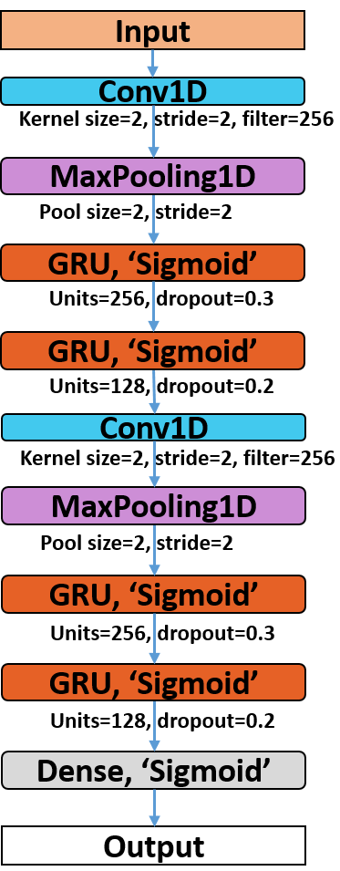
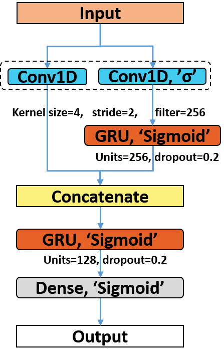
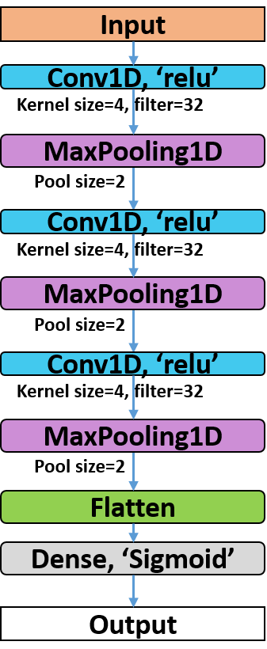
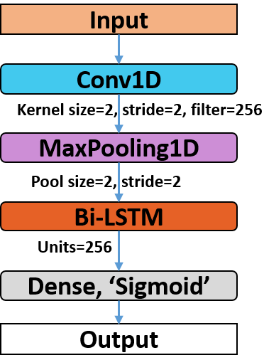
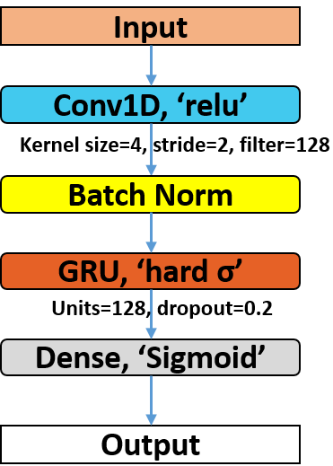

# Malware Detection

## Detecting malware with PE Header feature
In this project, we explored various machine learning algorithm for malware classification. We explore and compare some of the widely used deep learning models: CNN, LSTM, GRU, BiRNN, including ensemble models of the afromentioned models. We start-off the whole process with some basic preprocessing like removing unimportant features, applying zero padding, and splitting data for training-validation-testing. Then we stack some basic deep learning models like CNN and RNN models and tune the hyperparameters to get better result. Lastly, we ensemble all the stacked models into an ensemble model to reduce overfitting.

## Dataset
Download dataset: `kaggle competitions download -c cs5242-malware-detection`

## Model
Model used the same process during training, where each model is trained on the first 10-folds cross-validation of 3 epochs, 128 batches, and Adam algorithm with 0.001 learning rate on each fold. Subsequently, run another 10-folds cross validation of 2 epochs, 64 batches, and Adam with 0.0005 learning rate on each fold.
<!--  -->
<!--   -->
<!-- 

 -->

  

    
  

  

    
  

  

    
  

There are other models which are not shown here as they don't give significant improvement.

## Result
We started the base model by building a large dictionary of unique value for each feature and encoding all features into single scalar value. However, the result was only around 86% due to the information loss during the encoding. Then we kept the whole sequences data with pre-processing and get base result of around 96%.
